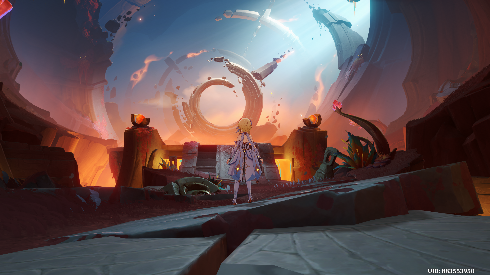

<div align="center">



[](https://git.io/typing-svg)

</div>

---

### `✦ Adventurers' Guild · Registration Card`

```
╔════════════════════════════════════════════╗
║  ADVENTURERS' GUILD · REGISTRATION CARD    ║
╠════════════════════════════════════════════╣
║  Name      : Atharv Thakare (Brelios)      ║
║  Class     : CS Undergrad                  ║
║  Region    : India                         ║
║  Path      : Cloud / Software Engineer     ║
║  Vision    : Hydro (flows around bugs)     ║
║  Goal      : Product company role          ║
║  Status    : Exploring. Always.            ║
╚════════════════════════════════════════════╝
```

---

### `✦ Character Profile`

```yaml
title:        "Builder. Breaker. Learner."
motto:        "Not here to follow the path, here to find one."
playstyle:
  - "curious by default"
  - "obsessive when interested"
  - "creative when stuck"
  - "practical when it matters"
current_quest: "Learning DSA + exploring Cloud infrastructure"
final_goal:    "Land a product company role. Build things that scale."
open_to:       ["Internships", "Collabs", "Open Source"]
```

---

### `✦ Talents`

| Talent | Skill |
|:--|:--|
| **Normal Attack** | Python, C, Java |
| **Elemental Skill** | Bash + Linux CLI |
| **Elemental Burst** | Artificial Intelligence + NLP |
| **Passive** | Breaking things on purpose, then fixing them |


---

### `✦ Artifact Set: Tools & Platforms`


---

### `✦ Farming Domains (Currently Learning)`

> Spending my Original Resin on:


---

### `✦ Exploration Progress`

<picture>
  <source media="(prefers-color-scheme: dark)"
    srcset="https://raw.githubusercontent.com/Brelios/Brelios/output/github-contribution-grid-snake-dark.svg" />
  <source media="(prefers-color-scheme: light)"
    srcset="https://raw.githubusercontent.com/Brelios/Brelios/output/github-contribution-grid-snake.svg" />
  
</picture>

---

### `✦ Active Quests (Projects)`

<table>
  <tr>
    <td width="100%">
      <h3>🧠 Opinion Meter <sub>· World Quest</sub></h3>
      <p><code>Python</code> &nbsp; <code>NLP</code> &nbsp; <code>AI</code> &nbsp; <code>Data Viz</code></p>
      <p>
        An AI-powered sentiment analysis engine for product reviews. It classifies sentiment,
        sorts and ranks products, visualizes trends, and surfaces recommendations based on
        aggregated user opinion data.
      </p>
      <p>
        
        
      </p>
      <a href="https://github.com/Brelios/OPINION-METER-V1REMAKE">
        
      </a>
    </td>
  </tr>
</table>

<table>
  <tr>
    <td width="100%">
      <h3>🏭 Satisfactory Factory Blueprint Builder <sub>· Side Quest</sub></h3>
      <p><code>Python</code> &nbsp; <code>FastAPI</code> &nbsp; <code>Next.js</code> &nbsp; <code>Graph Visualization</code></p>
      <p>
        A factory planner for Satisfactory. Give it your ore supply or a target product and it
        solves for machine counts, clock speeds and power use, then draws the production graph
        with belts, splitters and alternate recipe comparison.
      </p>
      <p>
        
        
      </p>
      <a href="https://satisfactoryfactorymanagementsystem.vercel.app/">
        
      </a>
    </td>
  </tr>
</table>

---

<div align="center">

### `✦ Send a Message by Serenitea Pot Mail`

*"Still compiling... but shipping anyway."*

[](https://www.linkedin.com/in/atharv-thakare-194139380/)
[](https://github.com/Brelios)
[](https://mail.google.com/mail/?view=cm&to=atharv1792006@gmail.com)

[](https://github.com/Brelios)


</div>
